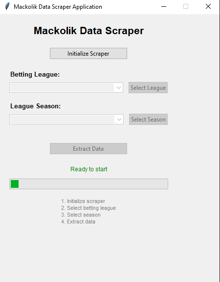
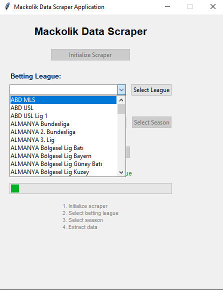
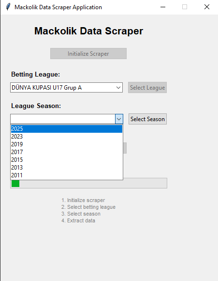
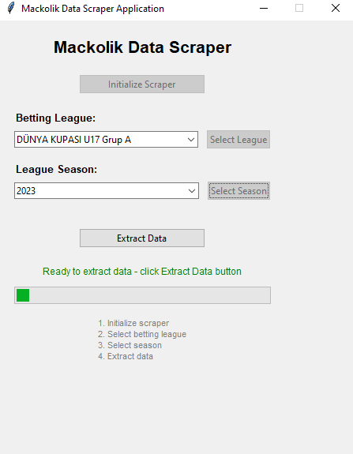
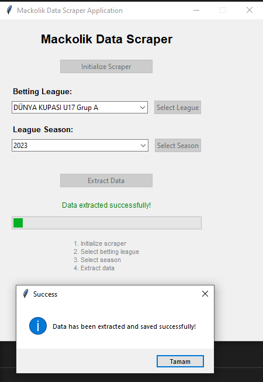

# Mackolik Betting Fixtures Data Scraper

A comprehensive Selenium-based web scraper with a user-friendly Tkinter GUI for automatically extracting betting league match data from Mackolik.com.

## 🌟 Features

- **Automated Data Extraction**: Scrapes betting league data from Mackolik website
- **User-Friendly GUI**: Intuitive Tkinter interface for easy operation
- **League Management**: Automatically lists and selects betting leagues
- **Season Selection**: Choose from available seasons for each league
- **Multiple Export Formats**: Save data in Excel (.xlsx) or CSV format
- **Error Handling**: Robust error management with status notifications
- **Real-time Progress**: Live updates during scraping process

## 🛠️ Requirements

- Python 3.7+
- Selenium WebDriver
- BeautifulSoup4
- Tkinter (included with Python)
- Pandas
- ChromeDriver or GeckoDriver

## 📦 Installation

1. Clone the repository:
```bash
git clone https://github.com/yourusername/mackolik-scraper.git
cd mackolik-scraper
```

2. Install required packages:
```bash
pip install -r requirements.txt
```

3. Download ChromeDriver and add to PATH or place in project directory:
   - Download from: https://chromedriver.chromium.org/
   - Ensure version compatibility with your Chrome browser

## 🚀 Usage

### GUI Application

1. Launch the application:
```bash
python desktop_app.py
```

2. Follow these steps in the GUI:

### Step 1: Initialize the Application
Click **"Initialize Scraper"** to start Selenium WebDriver



### Step 2: Select Betting League
Select your desired betting league from the dropdown and click **"Select League"**



### Step 3: Choose Season
Choose a season from the available options and click **"Select Season"**



### Step 4: Extract Data
Click **"Extract Data"** to begin the scraping process



### Step 5: Process Complete
Wait for the extraction to complete and view the success message



### Manual/Pipeline Usage

For direct code execution without GUI:

```python
from selenium_assistant_functions import *

# 0. Initialize Selenium
driver = start_selenium()

# 1. Skip advertisements
reklami_gec(driver)

# 2. Accept cookies
accept_cookies(driver, randomize_sleep_time(3))

# 3. Get page content
soup = get_current_soup(driver)

# 4. List betting leagues
iddaa_ligleri_list = get_iddia_ligleri_selection_list(soup)

# 5. Select league
selection_iddia_lig = "ALMANYA Bundesliga"
select_iddaa_ligi(driver, selection_iddia_lig)

# 6. Get season options
sezon_list = get_sezon_selections(soup)

# 7. Select season
selection_season = "2019/2020"
select_season(driver, selection_season)

# 8. Open fixtures page
open_fikstur_page(driver, randomize_sleep_time(3))

# 9. Get season weeks
sezon_haftalari_list = get_sezon_weeks(fikstur_page_soup)

# 10. Collect all weekly data
final_df = get_all_weeks_data(driver, sezon_haftalari_list)

# 11. Save to file
save_to_excel(final_df, selection_iddia_lig, selection_season)

# 12. Close browser
driver.quit()
```

## 📁 Project Structure

```
mackolik-scraper/
├── desktop_app.py                   # Main GUI application
├── selenium_assistant_functions.py  # Selenium helper functions
├── requirements.txt                 # Required Python packages
├── README.md                        # Project documentation
├── output/                          # Output directory for scraped data
└── screenshots/                     # GUI screenshots for README
```

## 🔧 Core Functions

### Primary Functions

| Function | Description |
|----------|-------------|
| `start_selenium()` | Initializes Selenium WebDriver |
| `reklami_gec()` | Skips website advertisements |
| `accept_cookies()` | Accepts cookie consent |
| `get_current_soup()` | Retrieves current page HTML content |
| `get_iddia_ligleri_selection_list()` | Lists available betting leagues |
| `select_iddaa_ligi()` | Activates selected league |
| `get_sezon_selections()` | Lists available seasons |
| `select_season()` | Activates selected season |
| `open_fikstur_page()` | Opens fixtures page |
| `get_sezon_weeks()` | Lists season weeks |
| `get_all_weeks_data()` | Collects all weekly match data |
| `save_to_excel()` | Saves data in Excel format |
| `save_to_csv()` | Saves data in CSV format |

## 📊 Output Format

The application saves match data in the following formats:

- **Excel**: `{League_Name}_{Season}.xlsx`
- **CSV**: `{League_Name}_{Season}.csv`

### Sample Data Structure
*[INSERT SAMPLE OUTPUT TABLE SCREENSHOT HERE]*

## ⚠️ Important Notes

- **Stable Internet**: Ensure reliable internet connection
- **Website Changes**: Code may require updates if Mackolik modifies their site structure
- **Rate Limiting**: Avoid excessive requests to prevent IP blocking
- **Driver Compatibility**: Ensure ChromeDriver version matches your Chrome browser
- **Respect ToS**: Use responsibly and respect website terms of service

## 🐛 Troubleshooting

### Common Issues and Solutions

| Issue | Solution |
|-------|----------|
| **ChromeDriver Error** | Download correct ChromeDriver version for your Chrome browser |
| **Element Not Found** | Increase wait times or verify page loading completion |
| **Connection Error** | Check internet connection and firewall settings |
| **Permission Denied** | Run with appropriate permissions or check output directory access |

## 🙏 Acknowledgments

- [Selenium](https://selenium-python.readthedocs.io/) for web automation
- [BeautifulSoup](https://www.crummy.com/software/BeautifulSoup/) for HTML parsing
- [Pandas](https://pandas.pydata.org/) for data manipulation
- [Tkinter](https://docs.python.org/3/library/tkinter.html) for GUI framework

## 📧 Contact

Sadık Kaçakçı - sadikkacakci90@gmail.com

---
